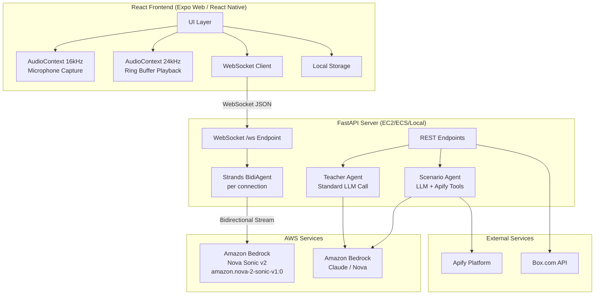
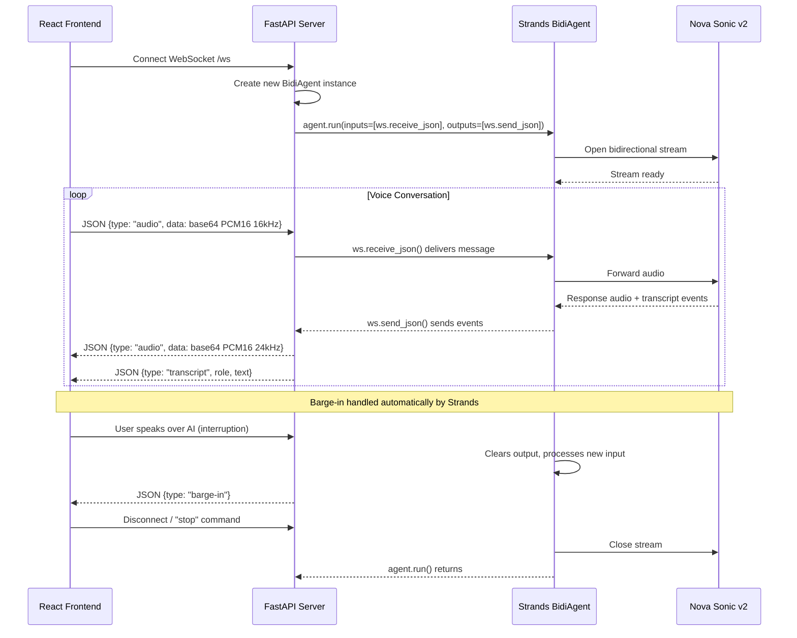
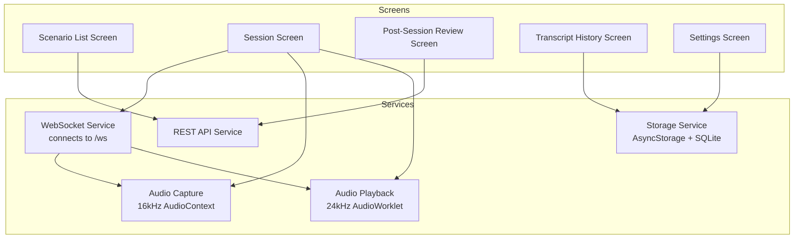

# Design Document

## Overview

Voice Language Practice is a mobile-first language speaking practice application that enables real-time voice conversations with AI in a target language. The system uses a multi-agent architecture where the real-time voice conversation is powered by AWS Nova Sonic v2 via the Strands Agents SDK `BidiAgent`, dramatically simplifying the WebSocket/streaming complexity.

The architecture is split into three tiers:
1. **React Frontend** — Captures microphone audio using Web Audio API (with echo cancellation), sends audio over WebSocket to the backend, and plays response audio through a ring-buffer AudioWorklet
2. **FastAPI Backend** — A persistent WebSocket server (running locally or on EC2/ECS) that creates a new `BidiAgent` per connection, plus REST endpoints for Teacher Agent, Scenario Agent, and Box upload
3. **AI Services** — Nova Sonic v2 for real-time voice (via Strands BidiAgent), standard Bedrock/LLM calls for Teacher Agent and Scenario Agent

Key design decision: **Use Strands `BidiAgent` directly** instead of a custom Voice Provider Abstraction Layer. The BidiAgent handles all WebSocket complexity, audio encoding, interruption handling, and concurrent tool execution. For hackathon MVP, we target Nova Sonic only. Gemini Live support is noted as future work.

## Architecture

### System Architecture Diagram



### Connection Flow Diagram



### Design Decisions

1. **Strands BidiAgent eliminates custom WebSocket plumbing**: The `BidiAgent` from `strands.experimental.bidi` wraps all Nova Sonic protocol complexity (session lifecycle, audio encoding, event multiplexing, interruption handling) into ~20 lines of code. No custom Voice Provider Abstraction Layer needed.

2. **One BidiAgent per WebSocket connection**: No shared state between sessions. Each connection gets a fresh agent instance with its own system prompt containing the scenario context. When the connection closes, the agent is stopped and garbage collected.

3. **FastAPI on persistent compute (NOT Lambda)**: Nova Sonic requires persistent WebSocket connections for the voice stream duration (up to 8 minutes). Lambda's 29-second API Gateway timeout and stateless model are incompatible. For hackathon MVP, run locally or on EC2/ECS.

4. **Two AudioContexts in the browser**: Web Audio API requires a single sample rate per context. Nova Sonic uses 16kHz input and 24kHz output, so the browser needs separate contexts for capture and playback.

5. **60-second ring buffer for audio pacing**: Nova Sonic generates audio faster than real-time after tool calls. The AudioWorklet ring buffer absorbs bursts and plays back at the correct hardware rate. Barge-in clears the buffer instantly (`readPos = writePos`).

6. **Echo cancellation via browser Web Audio API**: `getUserMedia({ echoCancellation: true })` handles acoustic echo cancellation at the client layer. No headset required. No server-side echo cancellation needed.

7. **REST endpoints for non-realtime agents**: Teacher Agent and Scenario Agent don't need real-time streaming — they're standard request/response LLM calls. These remain as REST endpoints on the same FastAPI server.

8. **Gemini Live as future work**: For hackathon MVP, only Nova Sonic is supported. A Gemini Live adapter could be added later as a separate WebSocket endpoint or by swapping the model in BidiAgent (if Strands adds support).

## Components and Interfaces

### FastAPI WebSocket Endpoint (Core Voice Session)

```python
from fastapi import FastAPI, WebSocket, WebSocketDisconnect
from strands.experimental.bidi import BidiAgent
from strands.experimental.bidi.models import BidiNovaSonicModel
from strands.experimental.bidi.tools import stop_conversation

app = FastAPI()

sonic_model = BidiNovaSonicModel(
    region_name="us-east-1",
    provider_config={
        "audio": {
            "input_rate": 16000,
            "output_rate": 24000,
            "voice": "tiffany",
        }
    },
)

@app.websocket("/ws")
async def websocket_endpoint(ws: WebSocket):
    """
    Each WebSocket connection gets its own BidiAgent.
    The system_prompt is constructed from the scenario context and target language
    sent by the client in the initial message.
    """
    await ws.accept()

    # First message contains session config
    init_msg = await ws.receive_json()
    scenario_context = init_msg.get("scenario_context", "")
    target_language = init_msg.get("target_language", "")

    system_prompt = build_conversation_prompt(scenario_context, target_language)

    agent = BidiAgent(
        model=sonic_model,
        tools=[get_vocabulary_hint, stop_conversation],
        system_prompt=system_prompt,
    )

    try:
        await agent.run(
            inputs=[ws.receive_json],
            outputs=[ws.send_json],
        )
    except WebSocketDisconnect:
        pass
    finally:
        await agent.stop()
```

### Conversation Tools (Strands @tool functions)

```python
from strands import tool

@tool
def get_vocabulary_hint(word_or_phrase: str, target_language: str) -> str:
    """Provide a vocabulary hint or translation for a word or phrase.

    Use this when the learner is struggling with a word or asks for help
    with vocabulary during the conversation.

    Args:
        word_or_phrase: The word or phrase to explain
        target_language: The language being practiced (ISO 639-1 code)
    """
    # In MVP, the model itself handles this via its knowledge.
    # This tool exists as a hook for future dictionary/flashcard integration.
    return f"Vocabulary hint requested for '{word_or_phrase}' in {target_language}"


@tool
def signal_session_complete(reason: str) -> str:
    """Signal that the conversation scenario has reached a natural conclusion.

    Use this when the role-play scenario has been completed successfully
    (e.g., the restaurant order is placed, directions have been given).

    Args:
        reason: Brief description of why the scenario is complete
    """
    return f"Session complete: {reason}"
```

### System Prompt Builder

```python
def build_conversation_prompt(scenario_context: str, target_language: str) -> str:
    """
    Constructs the system prompt for the BidiAgent.
    The scenario context and target language are injected here.
    """
    return f"""You are a language practice partner. You are role-playing a scenario
to help the user practice speaking {target_language}.

SCENARIO CONTEXT:
{scenario_context}

RULES:
- Speak ONLY in {target_language} unless the user explicitly asks for help in English
- Stay in character for the scenario
- If the user makes a grammar or vocabulary mistake, gently continue the conversation
  using the correct form (implicit correction)
- Keep responses conversational and natural — short sentences, natural pacing
- If the user says "stop", "goodbye", or "end session", use the stop_conversation tool
- If the scenario reaches a natural conclusion, use the signal_session_complete tool

VOICE STYLE:
- Speak at a moderate pace appropriate for a language learner
- Use clear pronunciation
- Pause briefly between sentences
"""
```

### Backend REST API Endpoints

| Endpoint | Method | Description |
|----------|--------|-------------|
| `GET /scenarios` | GET | Returns list of available scenarios |
| `POST /scenarios/generate` | POST | Invokes Scenario Agent to generate new scenarios |
| `POST /feedback` | POST | Invokes Teacher Agent for post-session evaluation |
| `POST /transcripts/upload` | POST | Uploads transcript to Box.com |
| `GET /health` | GET | Health check endpoint |
| `WebSocket /ws` | WS | Real-time voice session via BidiAgent |

### REST Endpoint Implementations

```python
from fastapi import FastAPI
from pydantic import BaseModel

# Teacher Agent (standard LLM call, not BidiAgent)
@app.post("/feedback")
async def get_feedback(request: FeedbackRequest) -> FeedbackResponse:
    """Invoke Teacher Agent for post-session evaluation."""
    # Uses standard Bedrock Converse API or Strands Agent (non-bidi)
    feedback = await invoke_teacher_agent(
        transcript=request.transcript,
        target_language=request.target_language,
        available_scenarios=request.available_scenarios,
    )
    return FeedbackResponse(feedback=feedback)


# Scenario Agent (standard LLM call with Apify tool)
@app.post("/scenarios/generate")
async def generate_scenarios(request: GenerateRequest) -> GenerateResponse:
    """Invoke Scenario Agent to generate new scenarios."""
    scenarios = await invoke_scenario_agent(
        target_language=request.target_language,
        proficiency_context=request.proficiency_context,
    )
    return GenerateResponse(scenarios=scenarios, success=True)


# Box upload
@app.post("/transcripts/upload")
async def upload_transcript(request: UploadRequest) -> UploadResponse:
    """Upload transcript to Box.com."""
    box_url = await upload_to_box(
        transcript=request.transcript,
        session_date=request.session_date,
        scenario_title=request.scenario_title,
    )
    return UploadResponse(box_file_url=box_url)
```

### Frontend Audio Architecture

```mermaid
graph TB
    subgraph Capture["Capture Path (16kHz AudioContext)"]
        Mic[getUserMedia<br/>echoCancellation: true]
        ScriptProc[ScriptProcessorNode]
        Encode[Float32 → PCM16 → Base64]
    end

    subgraph Playback["Playback Path (24kHz AudioContext)"]
        Decode[Base64 → PCM16 → Float32]
        Worklet[AudioWorkletNode<br/>60s Ring Buffer]
        Speaker[Audio Output]
    end

    subgraph WS["WebSocket"]
        Send[send JSON {type: audio, data}]
        Recv[receive JSON events]
    end

    Mic --> ScriptProc
    ScriptProc --> Encode
    Encode --> Send
    Recv --> Decode
    Decode --> Worklet
    Worklet --> Speaker
```

### AudioWorklet Ring Buffer (Client-Side)

```javascript
class AudioPlayerProcessor extends AudioWorkletProcessor {
  constructor() {
    super();
    // 60 seconds at 24kHz — handles faster-than-realtime bursts after tool calls
    this._bufferSize = 24000 * 60;
    this._buffer = new Float32Array(this._bufferSize);
    this._writePos = 0;
    this._readPos = 0;

    this.port.onmessage = (event) => {
      if (event.data.type === 'audio') {
        this._enqueue(event.data.samples);
      } else if (event.data.type === 'barge-in') {
        // Instantly clear playback buffer on interruption
        this._readPos = this._writePos;
      }
    };
  }

  _enqueue(samples) {
    for (let i = 0; i < samples.length; i++) {
      this._buffer[this._writePos % this._bufferSize] = samples[i];
      this._writePos++;
    }
  }

  process(inputs, outputs) {
    const output = outputs[0][0];
    for (let i = 0; i < output.length; i++) {
      if (this._readPos < this._writePos) {
        output[i] = this._buffer[this._readPos % this._bufferSize];
        this._readPos++;
      } else {
        output[i] = 0; // Silence when buffer is empty
      }
    }
    return true;
  }
}

registerProcessor('audio-player-processor', AudioPlayerProcessor);
```

### Multi-Agent Architecture

```mermaid
graph LR
    subgraph RealTime["Real-Time Voice (WebSocket)"]
        BidiAgent[BidiAgent<br/>+ Nova Sonic v2<br/>+ @tool functions]
    end

    subgraph REST["Request/Response (REST)"]
        TeacherAgent[Teacher Agent<br/>Standard LLM Call]
        ScenarioAgent[Scenario Agent<br/>LLM + Apify Tools]
    end

    subgraph Backend["FastAPI Server"]
        WSEndpoint[WebSocket /ws]
        FeedbackEndpoint[POST /feedback]
        ScenarioEndpoint[POST /scenarios/generate]
    end

    WSEndpoint --> BidiAgent
    FeedbackEndpoint --> TeacherAgent
    ScenarioEndpoint --> ScenarioAgent
    ScenarioAgent -->|@tool| Apify[Apify Actor]
```

- **Conversation Agent (BidiAgent)**: Handles real-time voice role-play via Nova Sonic v2. The scenario context goes in the `system_prompt`. Tool calls execute concurrently with audio streaming — no blocking, no silence gap.
- **Teacher Agent**: A standard Strands Agent (non-bidi) or direct Bedrock Converse call. Receives transcript text, produces structured feedback. Invoked via REST after session ends.
- **Scenario Agent**: A standard Strands Agent with Apify as a `@tool`. Scrapes phrasebook content and transforms it into structured scenarios. Invoked via REST.

### Mobile App Component Architecture



## Data Models

### Scenario

```typescript
interface Scenario {
  id: string;                  // Unique identifier (UUID)
  title: string;               // Display title
  description: string;         // Max 150 characters
  target_language: string;     // ISO 639-1 code
  key_vocabulary?: string[];   // Optional vocabulary hints
  system_prompt: string;       // Full scenario context for the BidiAgent
  source: "preloaded" | "backend" | "generated";
  created_at: string;          // ISO 8601 timestamp
}
```

### Session Transcript

```typescript
interface TranscriptEntry {
  role: "user" | "assistant";
  text: string;
  timestamp: string;           // ISO 8601
}

interface SessionRecord {
  id: string;                  // UUID
  scenario_id: string;
  scenario_title: string;
  target_language: string;
  started_at: string;          // ISO 8601
  ended_at: string;            // ISO 8601
  transcript: TranscriptEntry[];
  box_file_url?: string;       // Set after successful Box upload
  feedback?: SessionFeedback;  // Set after Teacher Agent evaluation
}
```

### Session Feedback

```typescript
interface SessionFeedback {
  performance_highlights: string[];
  areas_for_improvement: string[];
  corrections: Correction[];
  suggested_vocabulary: SuggestedPhrase[];
  suggested_scenarios: SuggestedScenario[];
  lesson_plan: LessonPlanItem[];
}

interface Correction {
  original: string;
  corrected: string;
  explanation?: string;
}

interface SuggestedPhrase {
  phrase: string;
  translation: string;
  context: string;
}

interface SuggestedScenario {
  id?: string;                 // References existing scenario if available
  title: string;
  description: string;
  rationale: string;           // Why this scenario is suggested
}

interface LessonPlanItem {
  focus_area: string;
  practice_phrases: string[];  // Up to 5 phrases
}
```

### WebSocket Message Protocol (Client ↔ FastAPI Server)

The BidiAgent's `inputs` and `outputs` use `ws.receive_json` and `ws.send_json` directly. The message format is determined by the Strands BidiAgent protocol. The client sends:

**Client → Server (Initial):**
```json
{
  "scenario_context": "You are a waiter at a French restaurant...",
  "target_language": "fr",
  "scenario_id": "uuid-here"
}
```

**Client → Server (Audio):**
```json
{
  "type": "audio",
  "data": "<base64 encoded PCM16 mono 16kHz>"
}
```

**Server → Client (Audio Response):**
```json
{
  "type": "audio",
  "data": "<base64 encoded PCM16 mono 24kHz>"
}
```

**Server → Client (Transcript):**
```json
{
  "type": "transcript",
  "role": "user" | "assistant",
  "text": "...",
  "is_final": true
}
```

**Server → Client (Interruption/Barge-in):**
```json
{
  "type": "barge-in"
}
```

**Server → Client (Session End):**
```json
{
  "type": "session_ended",
  "transcript": [...]
}
```

Note: The exact message format depends on how Strands BidiAgent serializes events through `ws.send_json`. The above represents the expected shape based on the reference implementation. The client should handle unknown message types gracefully.

### Backend API Request/Response Models

```python
from pydantic import BaseModel
from typing import Optional

# POST /feedback request
class FeedbackRequest(BaseModel):
    transcript: list[dict]  # [{role, text, timestamp}]
    target_language: str
    available_scenarios: list[dict]  # [{id, title}]

# POST /feedback response
class FeedbackResponse(BaseModel):
    feedback: dict  # SessionFeedback structure

# POST /scenarios/generate request
class GenerateRequest(BaseModel):
    target_language: str
    proficiency_context: Optional[str] = None

# POST /scenarios/generate response
class GenerateResponse(BaseModel):
    scenarios: list[dict]
    success: bool

# POST /transcripts/upload request
class UploadRequest(BaseModel):
    transcript: list[dict]
    session_date: str
    scenario_title: str

# POST /transcripts/upload response
class UploadResponse(BaseModel):
    box_file_url: str
```

## Correctness Properties

*A property is a characteristic or behavior that should hold true across all valid executions of a system — essentially, a formal statement about what the system should do. Properties serve as the bridge between human-readable specifications and machine-verifiable correctness guarantees.*

### Property 1: Scenario schema conformance

*For any* Scenario object returned by the backend (whether from the static list endpoint or generated by the Scenario Agent), it SHALL contain a non-empty unique identifier, a non-empty title, and a non-empty description, conforming to the same JSON schema.

**Validates: Requirements 1.3, 9.4, 9.6**

### Property 2: Scenario description length constraint

*For any* Scenario displayed in the app, the description text SHALL be at most 150 characters in length.

**Validates: Requirements 1.1**

### Property 3: System prompt includes scenario and language

*For any* combination of Scenario context and Target_Language, the system prompt constructed for the BidiAgent SHALL contain both the scenario context text and the target language identifier.

**Validates: Requirements 2.3, 6.3**

### Property 4: Transcript entries have valid speaker labels

*For any* TranscriptEntry produced during a session, the role field SHALL be exactly "user" or "assistant".

**Validates: Requirements 4.2**

### Property 5: Session record persistence round-trip

*For any* valid SessionRecord (containing transcript entries, session date, scenario title, and optional Box URL and feedback), persisting it to local storage and reading it back SHALL produce an equivalent record.

**Validates: Requirements 4.3, 8.4**

### Property 6: Transcript history reverse chronological ordering

*For any* collection of SessionRecords with distinct timestamps, the transcript history display order SHALL be strictly reverse chronological (most recent first).

**Validates: Requirements 4.4**

### Property 7: Local transcript persistence invariant

*For any* session that ends (regardless of whether the Box upload succeeds, fails, or times out), the complete transcript SHALL be persisted locally on the device.

**Validates: Requirements 8.9, 8.7**

### Property 8: Scenario merge deduplication

*For any* two lists of Scenarios (cached and newly generated), merging them SHALL produce a list where no two scenarios share the same unique identifier, and all unique scenarios from both lists are present.

**Validates: Requirements 9.10**

### Property 9: Feedback response structure validity

*For any* SessionFeedback returned by the Teacher Agent, it SHALL contain all six required sections (performance highlights, areas for improvement, corrections, suggested vocabulary, suggested scenarios, lesson plan), with suggested scenarios count between 1 and 3 inclusive, and lesson plan items count between 1 and 5 inclusive where each item has a focus area and up to 5 practice phrases.

**Validates: Requirements 10.4, 10.6, 10.9, 10.11**

### Property 10: Feedback persistence round-trip

*For any* valid SessionFeedback (including suggested scenarios and lesson plan), persisting it locally alongside its associated transcript and reading it back SHALL produce an equivalent feedback object.

**Validates: Requirements 10.13**

### Property 11: Conditional data-driven display

*For any* SessionRecord in the transcript history, the "View in Box" link SHALL be displayed if and only if the record has an associated Box file URL, and the "View Feedback" option SHALL be available if and only if the record has associated SessionFeedback.

**Validates: Requirements 8.5, 10.14**

## Error Handling

### Connection Errors

| Error Condition | Handling Strategy |
|----------------|-------------------|
| WebSocket connection to FastAPI fails | Retry up to 3 times with exponential backoff (1s, 2s, 4s). Display error after max retries. |
| WebSocket connection lost mid-session | Notify user immediately. Offer reconnect or end session. Preserve transcript collected so far. |
| Backend unreachable (REST endpoints) | Return cached/preloaded data where available. Display retry option for actions requiring backend. |
| Nova Sonic 8-minute session limit | Detect approaching limit (~7 min), notify user. For hackathon MVP, end session gracefully. Future: implement session rotation. |

### Audio Errors

| Error Condition | Handling Strategy |
|----------------|-------------------|
| Microphone permission denied | Block session start, display clear permission request |
| Audio interruption (phone call) | Pause session, auto-resume when interruption ends |
| Audio output device disconnected | Fall back to device speaker, continue session |
| Audio encoding/decoding failure | Log error, skip corrupted chunk, continue session |
| Ring buffer overflow (>60s of queued audio) | Should not occur in practice; if it does, reset buffer and continue |

### BidiAgent-Specific Error Handling

| Error Condition | Handling Strategy |
|----------------|-------------------|
| BidiAgent fails to connect to Nova Sonic | Return WebSocket error to client, client shows retry UI |
| Nova Sonic throttling (429) | BidiAgent handles internally; if persistent, close session with error |
| Voice ID invalid (case-sensitive) | Caught at server startup via configuration validation |
| Model ID mismatch | Caught at server startup; use `amazon.nova-2-sonic-v1:0` (NOT `amazon.nova-sonic-v2`) |
| Agent `stop_conversation` tool called | Graceful session end, send final transcript to client |

### Data Safety

- Transcripts are always persisted locally before any network operations
- Box upload failures never cause transcript data loss
- Teacher Agent failures never prevent transcript viewing
- Scenario generation failures fall back to cached/preloaded scenarios silently
- WebSocket disconnection preserves any transcript entries already received

## Testing Strategy

### Property-Based Testing

**Library**: [Hypothesis](https://hypothesis.readthedocs.io/) (Python backend) + [fast-check](https://fast-check.dev/) (TypeScript/React Native)

Property-based tests will validate the 11 correctness properties defined above. Each test runs a minimum of 100 iterations with generated inputs.

**Backend (Python/Hypothesis)**:
- Property 1: Generate random scenario data, validate schema conformance
- Property 3: Generate random scenario/language pairs, verify system prompt construction includes both
- Property 8: Generate random scenario lists with overlapping IDs, verify merge deduplication
- Property 9: Generate random feedback structures, validate all sections present with correct cardinality

**Mobile (TypeScript/fast-check)**:
- Property 2: Generate random strings, verify description length constraint
- Property 4: Generate random transcript events, verify role labels are "user" or "assistant"
- Property 5: Generate random session records, verify persistence round-trip
- Property 6: Generate random dated sessions, verify reverse chronological ordering
- Property 7: Generate random sessions with various upload outcomes, verify local persistence
- Property 10: Generate random feedback objects, verify persistence round-trip
- Property 11: Generate random session records with/without URLs and feedback, verify conditional display logic

**Tag format**: `Feature: voice-language-practice, Property {N}: {title}`

### Unit Testing

- System prompt builder (verify scenario + language inclusion)
- Audio chunk encoding/decoding (PCM16 ↔ Float32 ↔ Base64)
- Scenario merge logic edge cases (empty lists, all duplicates, no overlap)
- Feedback response parsing and validation
- WebSocket message serialization/deserialization
- Ring buffer enqueue/dequeue logic
- Barge-in buffer clearing

### Integration Testing

- End-to-end WebSocket session: connect → send init message → exchange audio → disconnect
- BidiAgent with mocked Nova Sonic (verify tool dispatch works)
- Box.com upload with mocked Box API
- Apify actor invocation with mocked Apify responses
- Teacher Agent invocation with mocked LLM responses
- FastAPI server startup and health check

### End-to-End Testing

- Full voice session flow: scenario selection → WebSocket connect → audio exchange → session end → transcript display
- Feedback flow: session end → request feedback → display feedback → navigate to suggested scenario
- Offline resilience: start app offline → display cached scenarios → attempt session → show appropriate errors

### Manual Testing

- Audio quality across devices (speaker, Bluetooth, headphones)
- Barge-in/interruption behavior (speak over AI response)
- Echo cancellation effectiveness (no headset, laptop speakers)
- 8-minute session limit behavior
- Audio pacing after tool calls (verify ring buffer handles bursts)
- Hands-free operation (screen off, background audio)
- Multi-language pronunciation recognition quality

